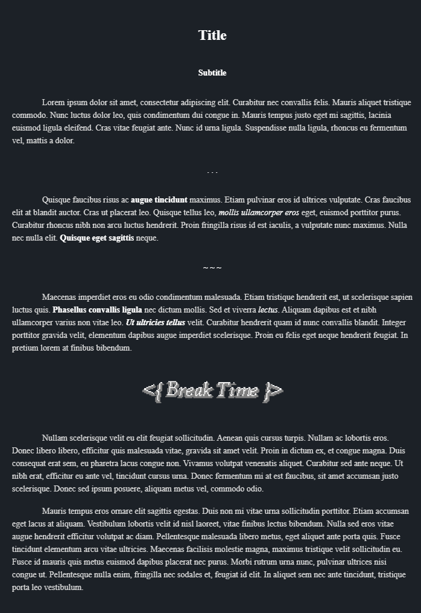

Current in development. Overall, meant to allow for easy writing of text like in a manuscript or traditional book format.

For more information on how to use it, check out [this example](https://github.com/GudBoiNero/manuscription-snippet/blob/main/Example.md)!

# Preview

# Docs

To create a manuscript block, you simply need to make an obsidian callout.

```md
> [!manuscript]
> Everything here will be formatted

Anything outside is unaffected
```

All the elements are specified like so:
```md
> ![manuscript|type] Optional Title
> Optional Content
```
## Titles and Subtitles
You can have as many titles as you want within a single `manuscript` block. All you need to do is to create a nested obsidian callout without our *manuscript* callout.

```md
> ![manuscript]
> > ![manuscript|title] Your Title Here!
```

Subtitles are the exact same except you replace `title` with `subtitle`.
```md
> ![manuscript]
> > ![manuscript|subtitle] Your Subtitle Here!
```
## Breaks
Breaks can be specified with the type `break`. The title will be ignored, the content will be display and centered. Images or text can be used.

```md
> ![manuscript]
> > ![manuscript|break] Ignored Title
> > . . .
```
## Customization
Using the [obsidian-style-settings](https://github.com/mgmeyers/obsidian-style-settings) plugin you can customize the styles of this snippet!
